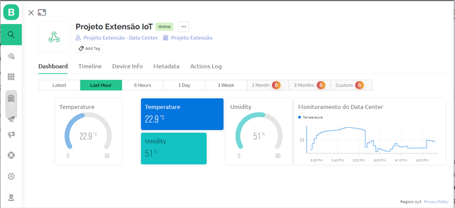
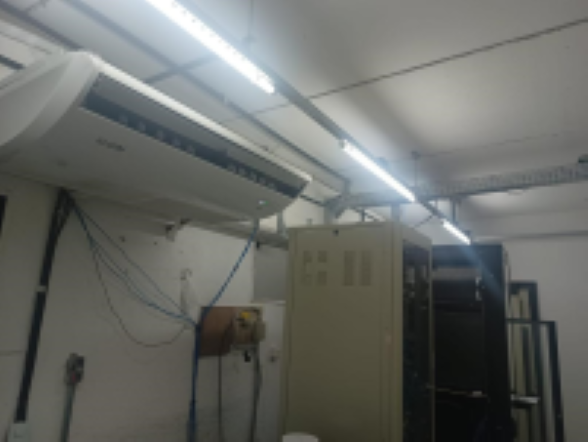
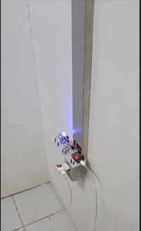
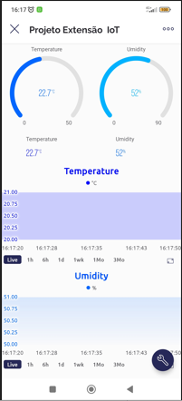

# 🌐 Sistema IoT de Monitoramento de Data Center

Projeto de extensão desenvolvido na **Universidade Estácio de Sá**, com o objetivo de monitorar **temperatura e umidade em tempo real** em um Data Center, utilizando **ESP32, sensores e plataformas IoT**.

## 🎯 Objetivo
Monitorar as condições ambientais de um Data Center (temperatura e umidade) em tempo real, prevenindo falhas nos sistemas de refrigeração e possíveis danos aos equipamentos.

## 🛠️ Tecnologias Utilizadas
- **ESP32** (WiFi + Bluetooth)
- **Sensor DHT11** (Temperatura e Umidade)
- **Arduino IDE**
- **Blynk** (monitoramento mobile e alertas)
- **ThingSpeak** (visualização de dados em nuvem)
- **Callmebot** (envio de mensagens via WhatsApp/Telegram)
- **Bibliotecas**:
  - `Adafruit_Sensor.h`
  - `DHT.h`
  - `Callmebot_ESP32.h`
  - `BlynkSimpleEsp32.h`
  - `ThingSpeak.h`

## ⚙️ Funcionalidades
- Leitura em tempo real de **temperatura e umidade**.
- Envio de dados para **ThingSpeak** (gráficos online).
- Monitoramento via **Blynk App** (mobile e web).
- Envio de **alertas via WhatsApp/Telegram** em caso de anomalias.
- Indicação visual com LEDs (verde/vermelho).

## 📊 Visualizações
- **ThingSpeak**: gráficos de temperatura e umidade.
- **Blynk App**: gauge e notificações push.
- **Alertas**: WhatsApp/Telegram via Callmebot.

## 📱 Imagens do Projeto

 

## 📄 Documentos do Projeto
- [Projeto Completo (pdf)](docs/Projeto_extensão_iot.pdf)
- [Banner de Apresentação (png)](docs/print/Banner.png)

## 📜 Licença
Este projeto é de uso **educacional** e está licenciado sob a licença MIT.  
